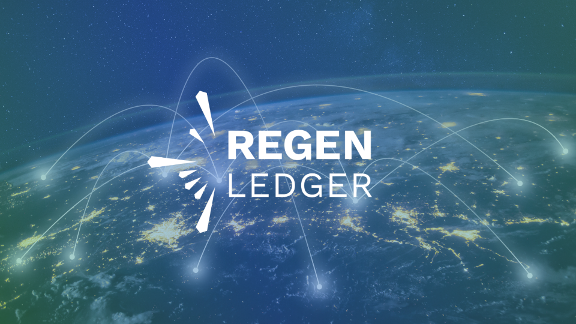

<div align="center" style="font-size:20px">
    
    <h3>
        <i>A distributed ledger for ecological assets and data claims</i>
    </h3>
</div>
<br />
<div align="center">
    <a href="https://github.com/regen-network/regen-ledger/blob/main/LICENSE">
        
    </a>
    <a href="https://github.com/regen-network/regen-ledger/releases/latest">
        
    </a>
    <a href="https://pkg.go.dev/github.com/regen-network/regen-ledger/v4">
        
    </a>
</div>
<br />
<div align="center">
    <a href="https://github.com/regen-network/regen-ledger/commits/main">
        
    </a>
    <a href="https://github.com/regen-network/regen-ledger/commits/main">
        
    </a>
    <a href="https://github.com/regen-network/regen-ledger/commits/main">
        
    </a>
    <a href="https://github.com/regen-network/regen-ledger/commits/main">
        
    </a>
</div>
<br />
<div align="center">
    <a href="https://github.com/regen-network/regen-ledger/issues">
        
    </a>
    <a href="https://github.com/regen-network/regen-ledger/issues?q=is%3Aissue+is%3Aopen+label%3A%22good+first+issue%22">
        
    </a>
    <a href="https://github.com/regen-network/regen-ledger/discussions">
        
    </a>
    <a href="https://discord.gg/regen-network">
        
    </a>
</div>
<br />
<div align="center">
    <a href="https://goreportcard.com/report/github.com/regen-network/regen-ledger">
        
    </a>
    <a href="https://codecov.io/gh/regen-network/regen-ledger">
        
    </a>
</div>
<br />

## Introduction

Regen Ledger is a blockchain application for ecological assets and data claims built on top of [Cosmos SDK](http://github.com/cosmos/cosmos-sdk) and [Tendermint Core](http://github.com/tendermint/tendermint). Leveraging these tools, Regen Ledger provides the infrastructure for a Proof-of-Stake blockchain network governed by a community dedicated to planetary regeneration.

Features specific to Regen Ledger are developed within this repository as custom modules that are then wired up to the main application. The custom modules developed within Regen Ledger follow the same architecture and pattern as modules developed within Cosmos SDK and other Cosmos SDK applications.

The core features that Regen Ledger aims to provide include the following:

- infrastructure for managing the issuance and retirement of ecosystem service credits
- a database of ecological state and change of state claims that spans both on and off-chain data sources
- mechanisms for automating the assessment of ecological state, making payments, and issuing assets

Regen Ledger is under heavy development and as result the above features are implemented to varying degrees of completeness. For more information about our approach and vision, see [Regen Ledger Specification](specs/regen-ledger.md).

## Documentation

Documentation for Regen Ledger is hosted at [docs.regen.network](https://docs.regen.network). This includes installation instructions for users and developers, information about live networks running Regen Ledger, instructions on how to interact with local and live networks, infrastructure and module-specific documentation, tutorials for users and developers, migration guides for developers, upgrade guides for validators, a complete list of available commands, and more.

## Contributing

Contributions are more than welcome and greatly appreciated. All the information you need to get started should be available in [Contributing Guidelines](./CONTRIBUTING.md). Please take the time to read through the contributing guidelines before opening an issue or pull request. The following prerequisites and commands cover the basics.

### Prerequisites

- [Git](https://git-scm.com) `>=2`
- [Make](https://www.gnu.org/software/make/) `>=4`
- [Go](https://golang.org/) `>=1.18`

### Running Tests

Run all unit and integrations tests:

```
make test
```

### Manual Testing

Build the regen binary:

```
make build
```

View the available commands:

```
./build/regen help
```

## Related Repositories

- [regen-network/governance](https://github.com/regen-network/governance) - guidelines and long-form proposals for Regen Mainnet
- [regen-network/mainnet](https://github.com/regen-network/mainnet) - additional information and historical record for Regen Mainnet
- [regen-network/testnets](https://github.com/regen-network/testnets) - additional information and historical record for Regen Testnets
- [regen-network/regen-js](https://github.com/regen-network/regen-js) - a JavaScript client library for interacting with Regen Ledger
- [regen-network/regen-web](https://github.com/regen-network/regen-web) - user interfaces for Regen Network and Regen Registry

## Sleeping in the Forest

> I thought the earth remembered me,  
> she took me back so tenderly,  
> arranging her dark skirts, her pockets  
> full of lichens and seeds.  
>
> I slept as never before, a stone on the river bed,  
> nothing between me and the white fire of the stars  
> but my thoughts, and they floated light as moths  
> among the branches of the perfect trees.  
>
> All night I heard the small kingdoms  
> breathing around me, the insects,  
> and the birds who do their work in the darkness.  
>
> All night I rose and fell, as if in water,  
> grappling with a luminous doom. By morning  
> I had vanished at least a dozen times  
> into something better.  
> 
> ― Mary Oliver
