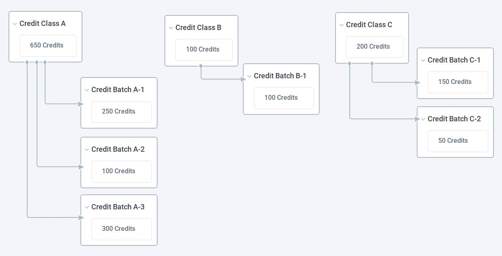
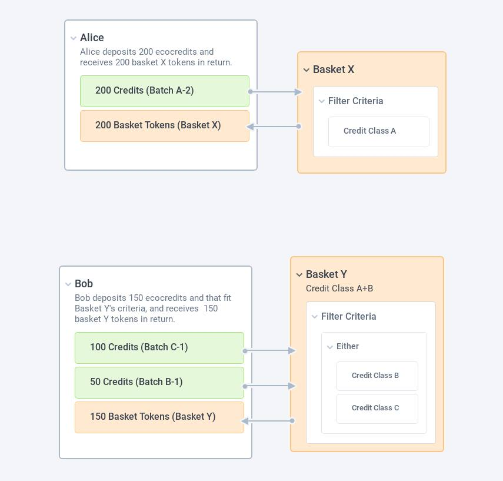
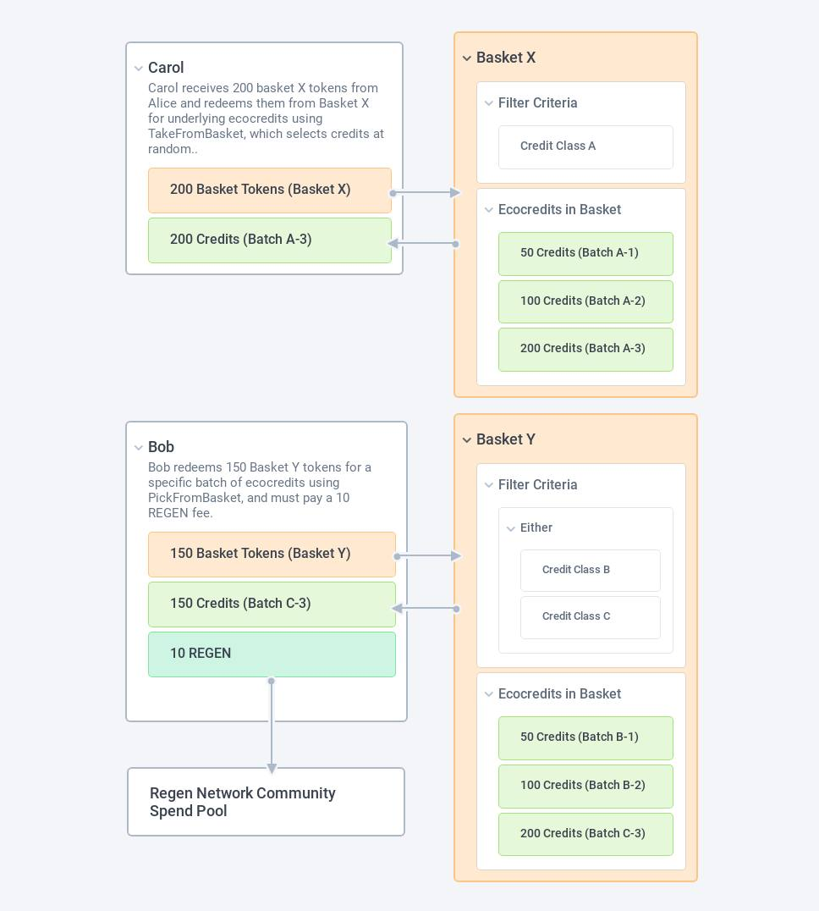

RFC-002: Baskets Specification
==============================

- Created: Fri Dec 3, 2021
- Status: __ACCEPTED__
- Superseded By: N/A
- RFC PR: [regen-ledger#107](https://github.com/regen-network/regen-ledger/pull/681)
- Original document: [google doc](https://docs.google.com/document/d/1YCmaQCI5ghll9IfMDAIPjImVPZpT7iZ7QpdVPVi-V5o/edit#)
- Authors: Darren Kong, Cory Levinson

# Background

### Ecocredit Module

The ecocredit module introduces a system for semi-fungible credits to be minted
on Regen Ledger through a hierarchical issuance system, with a set of
functional metadata intended to fit the use case of ecological assets (e.g.
carbon credits).

Credit classes are instantiated on-chain with a set of metadata (describing the
credit class), and a set of issuers (Regen Ledger addresses that have full
authority to issue batches of credits under that credit class).

Credits of a credit class are minted through a batch-issuance process, whereby
a credit issuer issues a batch of a fixed number of credits (e.g. 10,000
CarbonPlus Grasslands credits) with an associated set of metadata. This batch
will usually correspond with a “credit vintage” (in the terminology of carbon
markets). The metadata would point to attributes of that batch such as project
information, project location, start & end dates, links to monitoring reports,
etc.

The ecocredit module does not enforce or have an opinion on how or why credits
are decided to be issued by an issuer. While later phases of Regen Ledger may
incorporate auto-issuance via smart contracts, for now it is assumed that
credit issuance is a manual process with issuers holding full authority and
discretion of credit issuance.

Ecocredits are semi-fungible, where their fungibility is limited to the volume of
credits within the specific batch they were issued in.

| Example 1                                      | Example 2                     |
|------------------------------------------------|-------------------------------|
| **GIVEN** - John has 5 credits from batch A - Alice gives John 5 credits from batch A  **THEN** - John has 10 credits from batch A   *The credits in the end are combined numerically. This is because credits from the same batch are fully fungible/equivalent with each other.* | **GIVEN** - John has 5 credits from batch A - Alice gives John 5 credits from batch B  **THEN** - John has 5 credits from batch A and 5 credits from batch B  *The credits in the end are tracked separately by batch, even when held by the same user. This is because credits from different batches are not fungible with each other.* |

#### Credit Class & Batch Hierarchy (Fig. 1)

# The Baskets Use Case

When bringing ecocredits to market (e.g. offering them for sale on a decentralized exchange or to a potential buyer), there are a few issues we need to overcome:
- A buyer may want to purchase more ecocredits than is issued in any one batch
- A buyer may want to buy a large number of ecocredits without choosing which specific credit batches they come from
- An ecocredit owner may want to place their ecocredits in a liquidity pool, which require a very high volume of a credits to be locked in liquidity (higher volume than available in any one batch)

Baskets are intended to solve these problems, by aggregating heterogeneous ecocredits together. Baskets enable ecocredits from different batches to be deposited in a basket in exchange for redeemable vouchers, known as “basket tokens”. Any basket token is fully fungible with any other basket token from the same basket. And every basket token is redeemable for an underlying ecocredit that was originally put in the given basket.

These basket tokens in aggregate hold the same value as the sum of all the underlying ecocredits in the basket, and the basket tokens can be brought to market in a more unified form for a more streamlined credit buyer experience, and for using ecocredits in use cases which require more fungibility and/or higher volume.

Our hope is that these basket assets increase marketability of ecocredits in the following ways:
- Basket criteria provide market signals by curating acceptable standards
- Basket assets enable easy retail and corporate purchases at larger volumes
- Conversely, basket assets enable easy selling at larger volumes for brokers, project developers, and holders
- Basket assets enable greater composability in cryptocurrency/blockchain such as in DeFi for use as collateral
- Basket assets are more easily interoperable with existing carbon token standards that are emerging in other cryptocurrency/blockchain projects (e.g. KlimaDAO, MOSS Token)

# Specification

### Basket Criteria & Instantiation

Ecocredit baskets are containers/bundles for ecocredits meeting a specific set of criteria such as credit class, credit type, credit’s project location, credit’s vintage, etc. Baskets are instantiated with the following parameters:
- Basket Name & Display Name
- Basket Criteria - a set of attributes an ecocredit must have in order to be added to the basket
- Exponent (used for converting decimal ecocredits to integer bank denom)
- _disable_auto_retire_ - boolean that determines if credits are auto-retired when removed from the basket
- _enable_picking_ - boolean that enables or disables PickFromBasket functionality, where a basket token holder can select a specific desired ecocredit batch when redeeming ecocredits from the basket

In the long term, we anticipate that there may be baskets which utilize [a complex set of filter criteria](https://github.com/regen-network/regen-ledger/blob/26cb432c298245804dd56360437f7f96977cd39b/proto/regen/ecocredit/v1alpha2/types.proto#L263-L334) consisting of many different ecocredit fields joined together with AND/OR operators.

However, in the initial implementation of the basket criteria, we reduce the potential filter criteria to the following fields, which we see as the fields most needed for the initial baskets that we hope to see live:
- Credit Type
- Credit Class
- Project Location
- Batch Start Date
  - (>=, <=) a specific date
  - (>=) a relative date (e.g. 3 days ago, 2 years ago)
- Batch End Date
  - (>=, <=) a specific date
  - (>=) a relative date (e.g. 3 days ago, 2 years ago)

After instantiation, basket criteria can be upgraded by the basket creator. Other fields (name, exponent, picking & auto-retire options) are set at instantiation and cannot be changed later.

### Basket Curators & Governance

The address that creates the basket is referred to as the basket’s curator.

Basket creation will require a fixed fee, payable in REGEN (similar to the fixed fee for Credit Class creation). The funds should go to the community spend pool. This fixed fee will be an on-chain parameter controlled via network governance. In the initial software upgrade proposal the fee should start at 1,000 REGEN.

Future iterations of the fixed fee functionality could involve reduced fees based on a users staked REGEN, or similar mechanics.

### Basket Tokens (Depositing & Redeeming)

Once instantiated, baskets allow holders of eligible credits to deposit those credits and, in return, receive a redeemable 1:1 voucher. These vouchers are known as basket tokens.

Basket token holders may hold them or sell them — potentially on Regen marketplace or on an external market such as Osmosis, an automated-market maker (AMM) blockchain in the Cosmos ecosystem, or Sushiswap, Uniswap, et al AMMs in another blockchain.

A basket token holder may also later redeem their basket tokens in exchange for an equal amount of ecocredits in the basket, one for one. There are two ways to redeem ecocredits that a basket token holder may choose from:
- **PickFromBasket**: picking a specific set of ecocredits from discrete batches in the basket (and paying a fixed fee in REGEN that is sent to the Community Spend Pool). Future versions of PickFromBasket may allow for a portion of fees to be sent to the basket curator, and for fee amount to be set at basket instantiation.
- **TakeFromBasket**: taking an equivalent number of ecocredits from the basket, oldest credits first based on batch start date, from one or more ecocredit batches in the basket (at no fee)

TakeFromBasket redeems ecocredits oldest first, a mechanism which mitigates a basket's aging. A basket with considerable Take redemptions and new deposits will have a healthy cycling of credits, facilitating a freshness to the basket. 

PickFromBasket (if enabled) affords the possibility of arbitrage between basket tokens and ecocredits. The market may value a specific ecocredit higher than the underlying basket token price. As traders execute such arbitrage opportunities, it is expected that the basket token price should move towards the “floor price”, the average price of the lowest valued credits in a given basket. A user may also find a specific ecocredit more valuable to them for intrinsic reasons (e.g. holding an ecocredit from a specific bioregion for offsetting).

An ecocredit holder has the ability to retire, transfer, or hold their ecocredits. In the future, there could be the opportunity to create an ability to retire a basket token wherein a random underlying ecocredit would be retired on behalf of that basket token retirement (equivalent of redeeming a basket token for an ecocredit with a Take action and then retiring that taken ecocredit).

#### Ecocredit Basket Depositing (Fig. 2)

#### Ecocredit Basket Redemption (Fig. 3)

# Prior Art

### NFTX

Prior art for this design comes from the non-fungible token space with NFTX, which allows for fungible “voucher” ERC-20 tokens to be “minted” in exchange for an underlying ERC-721 tokens in the pool/basket (e.g. $PUNK and Cryptopunk NFTs).

### Toucan / Base Carbon Ton (BCT)

Toucan’s Base Carbon Ton (BCT) which is used by KlimaDAO uses a similar model as this Basket specification.

Toucan has a process where credits are retired on the Verra registry (off-chain) with a hash retrieved from the Toucan bridge application. The serial # of the Verra retirement is then inputted into the Toucan bridge application to mint a Batch NFT. This Batch NFT is, then, fractionalized into TCO2 tokens which are semi-fungible (like Regen’s ecocredit tokens). These TCO2s are then deposited into the Base Carbon ton pool (like Regen’s basket). These BCTs are the initial carbon credit tokens accepted by the KlimaDAO reserve. Tokens can be swapped back from the BCTs to later be burned, to destroy them from supply (this functionality has yet to be built). In the future, Toucan/Klima will have multiple pools; we are working with them on the nature-based Base Carbon Ton (nBCT).

### MOSS

MOSS has a process where they act as a centralized custodian for their Verra registry account. They, on an on-going basis, monitor the Ethereum ledger of their ERC20 token for tokens sent to a retirement address (a non-functional “burn” address so to speak). MOSS then reciprocates retirement of credits in their Verra account. There is a liquid market for MOSS tokens on Uniswap and other Ethereum-based decentralized exchanges as well as traditional centralized exchanges.
