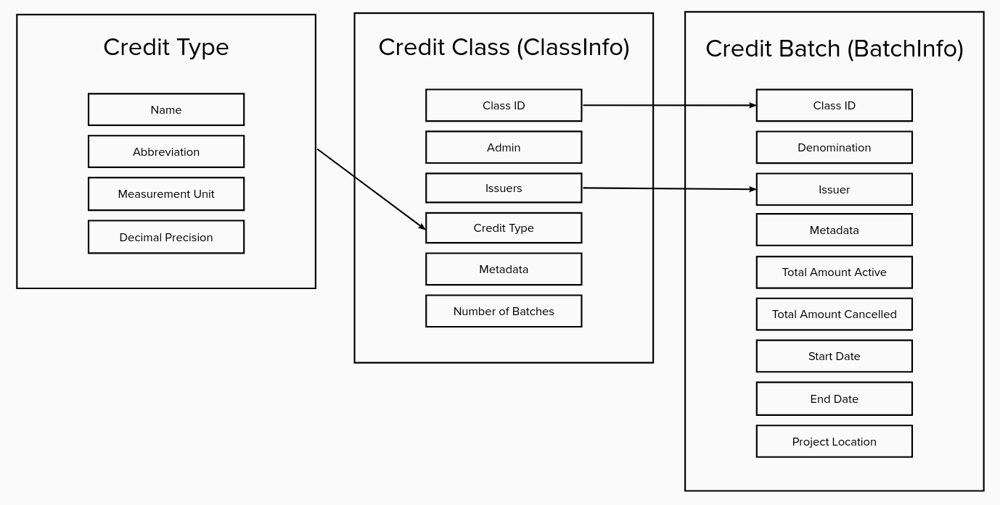
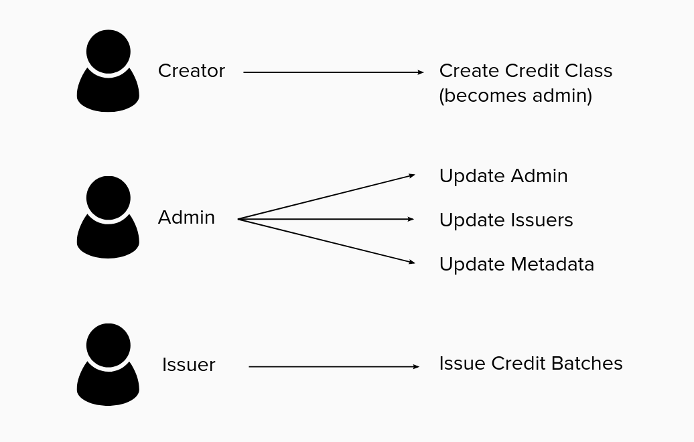
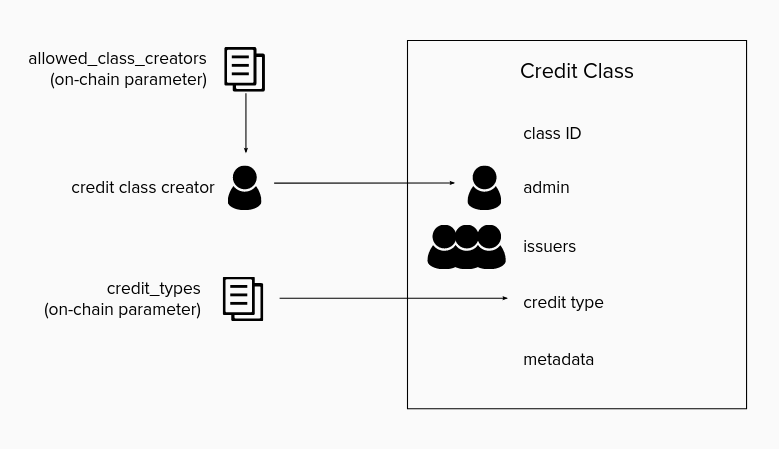

# Concepts

## Ecocredit Core

### Credit Class

A credit class is the primary abstraction for an ecosystem service credit. Each credit class is associated with a credit type that represents the primary unit of measurement that the credit accounts for (e.g. metric tons of CO2e sequestered). Information about the accepted methodologies for each credit class are typically stored off chain and referenced in the credit class's `metadata` field using a hash-based content identifier, such as an [IRI](../data/01_concepts.html#iri).

Each credit class also has an admin (an address with permission to update the credit class) and a list of approved issuers (addresses with permission to issue credit batches under the credit class).

For more information about the properties of a credit class, see [ClassInfo](https://buf.build/regen/regen-ledger/docs/main:regen.ecocredit.v1#regen.ecocredit.v1.ClassInfo).

### Project

A project describes the high-level on-chain information for a project implementing the approved methodologies defined within a credit class. Each credit batch is associated with a project, giving every issuance of credits a direct link to information about the project responsible for the ecological regeneration represented by the credit batch.

Over a project's lifecycle, it's expected that many credit batches will be issued at different points in time (e.g. at the conclusion of each monitoring period). To ensure that only legitimate projects are registered on-chain, projects can only be created by an issuer for the given credit class.

For more information about the properties of a project, see [ProjectInfo](https://buf.build/regen/regen-ledger/docs/main:regen.ecocredit.v1#regen.ecocredit.v1.ProjectInfo).

### Credit Type

A credit type is the primary unit of measurement used by the approved methodologies defined within a credit class. A credit type includes a name (e.g. carbon, biodiversity), an abbreviation (a set of 1-3 uppercase characters), a measurement unit (e.g. kilograms, tons), and a decimal precision.

The credit type abbreviation is used to construct the credit class ID. For example, `C01` is the ID for the first credit class that uses the `carbon` credit type where `C` is the credit type abbreviation and `01` is the sequence number (i.e. the first credit class for the given credit type).

The list of allowed credit types is managed via on-chain governance. Adding a new credit type to the list requires a parameter change proposal.

For more information about the properties of a credit type, see [CreditType](https://buf.build/regen/regen-ledger/docs/main:regen.ecocredit.v1#regen.ecocredit.v1.CreditType).

### Credit Class Creator Allowlist

The ecocredit module supports the option of restricting credit class creation to a set of addresses. Enabling this restriction and maintaining the list of allowed credit class creators are both controlled via on-chain governance and can only be updated through parameter change proposals.

### Credit Class Admin

The credit class admin is the address with the authority to update a given credit class (i.e. to update the admin, the list of approved issuers, and the metadata). When a credit class is created, the admin is initially set to the address that created the credit class.

### Credit Class Issuers

The credit class issuers are the addresses with the authority to issue credit batches under the given credit class. The list of credit class issuers is defined at the time the credit class is created and only the admin can update the list after the credit class is created.

### Credit Batch

All credits are issued in discrete batches by credit issuers. A credit batch refers to a batch of credits issued at a single point in time for a given credit class and project.

Each credit batch has a unique ID (i.e. denomination) that starts with the abbreviation of the credit type followed by the start date, end date, and batch sequence number. For example, `C01-20190101-20200101-001` would be the first batch issued (`001`) from the first carbon credit class (`C01`) and the amount of carbon sequestered was measured between `20190101` and `20200101`.

Each credit batch is associated with an on-chain project, linking information about the on-the-ground project implementing the methodologies defined within the credit class. Additional information about a credit batch can be attached to the metadata field. When credits are issued, they can be issued in a tradable or retired state. The credit batch also tracks the total number of active credits (tradable and retired credits) and the total number of cancelled credits.

For more information about the properties of a credit batch, see [BatchInfo](https://buf.build/regen/regen-ledger/docs/main:regen.ecocredit.v1#regen.ecocredit.v1.BatchInfo).

### Credits

Credits are issued in credit batches in either a tradable or retired state. The owner of tradable credits can send, retire, or cancel the credits at any time. Tradable credits are only fungible with credits from the same credit batch. Retiring a credit implies the owner of the credit is consuming it as an offset. Retiring a credit is permanent. Cancelled credits are credits that have moved to another registry. 

### Tradable Credits

Tradable credits are credits that the owner has full control over. Tradable credits can be transferred by the owner to another account, put into a basket in return for basket tokens (see [basket](#basket-submodule) for more information), or listed for sale in the [marketplace](#marketplace-submodule), placing the credits in escrow until the sell order is either processed or cancelled (or the credit amount within the sell order is updated). Tradable credits can be retired or cancelled by the owner at any time.

### Retired Credits

Retiring a credit is equivalent to burning a token with the exception that retired credits are actively tracked after they are retired. Retiring a credit implies the owner of the credit is consuming it as an offset. Credits can be retired upon issuance, upon transfer, upon being taken from a [basket](#basket-submodule), upon being sold in the [marketplace](#marketplace-submodule), or directly by the owner. Retiring a credit is permanent.

### Cancelled Credits

Cancelled credits are credit that cannot be transferred or retired. Credits are cancelled in the event that the credit has moved to another registry.

## Basket Submodule

### Basket

A basket is an abstraction for different types of credits that meet a defined criteria. Credits can be put into a basket in exchange for an equivalent amount of basket tokens. The basket criteria can be set to only accept a specific credit type, credit classes, and credit batches that meet a specific date criteria (e.g. credit batches with a minimum start date, credit batches with a start date within a duration of time, or credit batches with a start date year within a number of years into the past). Basket tokens can be returned to the basket at any time in exchange for the equivalent amount of credits.

For more information about the properties of a basket, see [Basket](https://buf.build/regen/regen-ledger/docs/main:regen.ecocredit.basket.v1#regen.ecocredit.basket.v1.Basket).

### Basket Tokens

Basket tokens are minted when credits are put into a basket. Upon putting credits into a basket, the owner receives the equivalent amount of basket tokens. Basket tokens are fully fungible with other tokens from the same basket. Basket tokens are minted using the bank module from Cosmos SDK, and are therefore compatible with IBC, enabling basket tokens to easily move across chains. Basket tokens can be returned to the basket in exchange for the equivalent amount of credits.

## Marketplace Submodule

### Storefront

The ecocredit module supports marketplace functionality using a simple storefront model. Credit owners can create sell orders that can then be processed through direct buy orders. Credits can be auto-retired or remain in a tradable state upon purchase.

### Sell Order

A sell order is an order to sell credits and is created by the owner of the credits. The seller sets the quantity of credits and the asking price. The asking price must use an approved token denomination listed within the on-chain parameter. When a sell order is created, the credits are held in escrow. The seller has the option to auto-retire the credits upon being sold and the option to allow for partial fills. The seller can update or cancel the order at any time. When a sell order is cancelled the credits are returned from escrow.

For more information about the properties of a sell order, see [SellOrder](https://buf.build/regen/regen-ledger/docs/main:regen.ecocredit.marketplace.v1#regen.ecocredit.marketplace.v1.SellOrder).

### Direct Buy Order

A direct buy order is an order to buy credits from a specific sell order. The buyer specifies the quantity of credits to buy. If partial fills are enabled in the sell order, the buyer can specify a quantity less than the available quantity. If partial fills are disabled, the buyer must specify the total quantity of credits. The buyer has the option to disable auto-retirement only if the sell order has also disabled auto-retirement. If auto-retirement is enabled, the credits are retired upon being sent to the buyer.

### Allowed Denom

An allowed denom is a token denomination that has been approved to use within a sell order. A seller can only provide an ask price in a token denomination that is included in an on-chain parameter set through an on-chain governance process.

For more information about the properties of an allowed denom, see [AllowedDenom](https://buf.build/regen/regen-ledger/docs/main:regen.ecocredit.marketplace.v1#regen.ecocredit.marketplace.v1.AllowedDenom).

 

---

 

